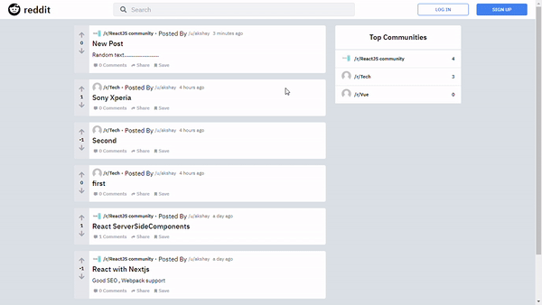

# Reddit Clone

## Tech Stack :

Reddit Clone using Nodejs, Express for back-end. Postgres with typeORM for DB. And NextJS with tailwindcss for front-end.

       

## Features:

    1. User Signup and Signin.
    2. Create Sub (Community)
    3. Create Post for Subs.
    4. Comment on Posts.
    5. Vote on posts and comments.

## Demo:

